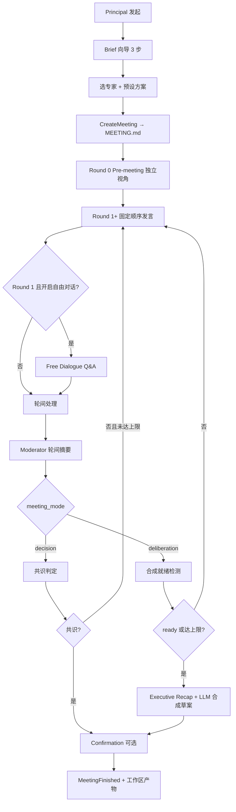

# 研讨型 / 裁决型会议流程总览

> 存档日期：2026-06-28。描述 Engine v0.2 主干与 Discord Principal 体验，并记录已知改进方向。

---

## 一、共用主干（两种模式相同）

| 环节 | 机制 |
|------|------|
| 调度 | 固定注册顺序，每轮相同 |
| Pre-meeting | Round 0，互不可见，收集初始视角 |
| 辩论轮 | 按 Order 依次 LLM 发言 |
| 自由对话 | **仅 Round 1 后**，每人最多 N 轮「问相邻下一位」 |
| 轮间摘要 | LLM（可关）→ `moderator/round-N-summary.md` + Discord |
| 工作区 | `MEETING.md`、`MINUTES.md`、`rounds/`、`artifacts/` |

---

## 二、裁决型（decision）

**目标：** 围绕 Topic 形成可执行共识（默认 Goal）。

| 阶段 | 行为 |
|------|------|
| 专家发言 | `Phase: debate`，需返回 **agree / object / abstain** |
| 轮间摘要 | 按 object / 非 object 分组，写「分歧 vs 缓解措施 + 共识状态」 |
| 轮后 | **No Objection** 共识策略：无人 object → `ConsensusReached` |
| 僵局 | 达 `max_rounds` → Moderator Decision 兜底 |
| 终局 | 共识结论 + 可选 **Confirmation**（Principal 批准/驳回） |
| 产物 | `MINUTES.md`、确认关 `confirmation/brief.md` |

**Principal 干预：** 暂停 / 终止 / 强制共识（`Force Consensus`）。

---

## 三、研讨型（deliberation）

**目标：** 形成可评审的 **设计草案**（Brief 提供 Goal + Agenda + 范围）。

| 阶段 | 行为 |
|------|------|
| 专家发言 | `Phase: deliberation`，**不投票**，贡献设计点/约束/待决 |
| 轮间摘要 | LLM 归纳：进展 / 趋同 / 分歧 / 下轮焦点 |
| 轮后 | **不做共识投票**；≥ `min_rounds` 后 **LLM 合成就绪** |
| 提前结束 | ready → 合成（`resolved_by=readiness`） |
| 终局链 | **Executive Recap**（过程回顾）→ **LLM 方案合成**（按 Agenda 分节或 flat） |
| 产物 | `design-draft.md`、`open-questions.md`、Recap、各轮 readiness |
| Confirmation | 审「草案是否足够进入下一环节」（按议程分节 Brief） |

**Principal 干预：** 另可 **强制合成**（`Force Synthesis`）。

合成输出语义（有 Brief 议程时）：

- **summary** — 该议程的设计快照
- **decisions** — 增量已决（可为空）
- **open_questions** — 待 Principal/后续拍板
- **cross_cutting** — 跨议程共识与待决

---

## 四、Discord 侧 Principal 体验

- 自然语言 / `!rt meet` 开会 + **Brief 三步向导**
- 启动 ack **展示 Brief 正文**
- 轮间摘要、Executive Recap **推频道**
- Reception Agent（查状态、专家管理、带确认的开会）
- 专家独立 Bot 发言；Moderator（陈诗婷）推进度与摘要

---

## 五、改进 backlog（按优先级）

### P0 — 直接影响会议质量

1. **Brief 与合成强绑定** — 跳过 Brief 时 Agenda 为空，合成退化为 flat。
2. **「闪电 1 轮」与 `min_rounds_before_synthesis` 的张力** — 讨论很薄就出草案。
3. **同轮内专家互问无法闭环** — 需等自由对话或下一轮。
4. **合成 prompt 体量** — ✅ 已实现：早轮仅 Moderator 摘要 + 最后一轮全文（2026-06-28）。
5. **终局总括结论** — ✅ 已实现：`executive_verdict` + `key_decisions`（2026-06-28）。

### P1 — Moderator / 产物体验

6. **Discord 合成阶段 UX** — 避免流式 JSON 泄露。
7. **裁决型 Decision Recap** — 争点表 + 推荐结论再进 Confirmation。
8. **Principal 档案未注入** — ADR-0010 `USER.md` 未进 Engine prompt。（Web Persona 编辑 ✅；Engine 注入仍 🔲）

### P2 — 机制与产品

9. **自由对话模型偏窄** — 仅 R1 后、相邻配对。
10. **发言顺序固定** — 后发言者信息优势。
11. **Reception `start_meeting` 未走 Brief 向导**。
12. **Web 与 Discord parity** — 部分完成：Artifact 浏览、Brief 模板、Principal 画像、下载/删除 ✅；完整开会向导、Confirmation ItemNotes 编辑 🔲。
13. **会中 Brief 修正**。
14. **质量闭环** — Confirmation 驳回原因结构化反馈。
15. **Readiness 与末轮追问** — 轻量规则 guard。

---

## 六、一句话对照

| | 裁决型 | 研讨型 |
|---|--------|--------|
| 专家怎么说话 | 表态投票 | 共建方案 |
| 怎么结束 | 无人 object / 达上限 Moderator 拍板 | 就绪检测 / 达上限 / Principal 强合 |
| 终局是什么 | **共识结论** | **设计草案 + 待决清单** |
| LLM 终局整合 | 弱（靠共识 + Confirmation Brief） | **强**（Recap + deliberation-synthesis） |

---

## 参考

- [ADR-0011 — Meeting Mode](../architecture/ADR-0011-meeting-mode.md)
- [ADR-0002 — Consensus Strategy](../architecture/ADR-0002-consensus-strategy.md)
- [Meeting State Machine](./state_achine.md)
